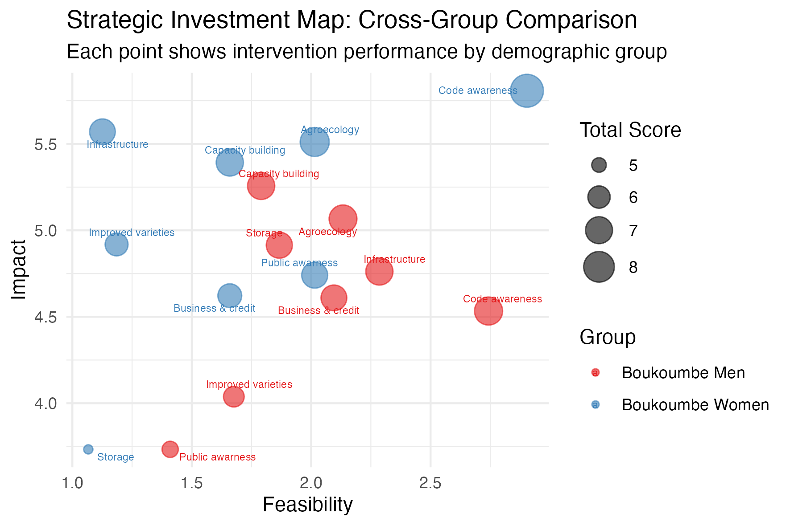

<!-- add yaml subtitle Akkra region in Nattitengu etc.)  -->
<!-- dates of workshop -->

```{r setup, include=FALSE}
knitr::opts_chunk$set(echo = FALSE, warning = FALSE, message = FALSE)
library(tidyverse)
library(plotly)
library(ggrepel)
```

## Impact Assessment 

Interventions and objectives were identified through expert consultation with 50 participants (13 producers, 9 traders, 2 transporers, 2 restrarants, 1 processor, 1 microfinancer, 4 consumers, 5 NGOs, 4 administrative authorities, 7 agricultural institutions, 2 import suppliers). The impact assessment conducted via card-based voting (1=low, 2=medium, 3=high impact). We normalized the responses using Percentage of Maximum Possible (POMP) scoring [@cohen1999pomp] to account for participation rates and enable cross-intervention comparison. This approach aligns with established participatory methods in rural development [@chambers1994participatory] and stakeholder engagement metrics [@reed2009stakeholder]. 

The decision modeling team included 13 *(academics, nutritionists, research institution members)*.  

```{r load_and_adjust_unified_matrix}
high_vote_score <- 3

source("R/normalize_intervention_data.R")

source("R/create_full_heatmap_data.R")

######### crincrin ###########

# Load the transposed matrix for all
unified_matrix_crincrin_all <- read_csv("data/crincrin_data/interventions_matrix_all.csv")

normalized_matrix_crincrin_all <- normalize_intervention_data_crincrin(
  unified_matrix = unified_matrix_crincrin_all,
  total_participants = 55,
  high_vote_score = high_vote_score
)

full_heatmap_data_crincrin <- 
  create_full_heatmap_data(normalized_matrix_crincrin_all)

heatmap_data_crincrin_all <- full_heatmap_data_crincrin %>%
  filter(intervention != "weight") %>%
  filter(label != "PRIORITY WEIGHTS") 

# Men Boukoumbe

unified_matrix_crincrin_men_boukoumbe <- read_csv("data/crincrin_data/interventions_matrix_men_boukoumbe.csv")

normalized_matrix_crincrin_men_boukoumbe <- normalize_intervention_data_crincrin(
  unified_matrix = unified_matrix_crincrin_men_boukoumbe,
  total_participants = 14,
  high_vote_score = high_vote_score
)

full_heatmap_data_men_boukoumbe <- 
  create_full_heatmap_data(normalized_matrix_crincrin_men_boukoumbe)

full_heatmap_data_men_boukoumbe <- full_heatmap_data_men_boukoumbe %>%
  filter(intervention != "weight") %>%
  filter(label != "PRIORITY WEIGHTS") 

# Men Natitingou

unified_matrix_crincrin_men_natitingou <- read_csv("data/crincrin_data/interventions_matrix_men_natitingou.csv")

normalized_matrix_crincrin_men_natitingou <- normalize_intervention_data_crincrin(
  unified_matrix = unified_matrix_crincrin_men_natitingou,
  total_participants = 13,
  high_vote_score = high_vote_score
)

full_heatmap_data_men_natitingou <- 
  create_full_heatmap_data(normalized_matrix_crincrin_men_natitingou)

full_heatmap_data_men_natitingou <- full_heatmap_data_men_natitingou %>%
  filter(intervention != "weight") %>%
  filter(label != "PRIORITY WEIGHTS") 

# Women Boukoumbe

unified_matrix_crincrin_women_boukoumbe <- read_csv("data/crincrin_data/interventions_matrix_women_boukoumbe.csv")

normalized_matrix_crincrin_women_boukoumbe <- normalize_intervention_data_crincrin(
  unified_matrix = unified_matrix_crincrin_women_boukoumbe,
  total_participants = 9,
  high_vote_score = high_vote_score
)

full_heatmap_data_women_boukoumbe <- 
  create_full_heatmap_data(normalized_matrix_crincrin_women_boukoumbe)

full_heatmap_data_women_boukoumbe <- full_heatmap_data_women_boukoumbe %>%
  filter(intervention != "weight") %>%
  filter(label != "PRIORITY WEIGHTS") 

# Women Natitingou

unified_matrix_crincrin_women_natitingou <- read_csv("data/crincrin_data/interventions_matrix_women_natitingou.csv")

normalized_matrix_crincrin_women_natitingou <- normalize_intervention_data_crincrin(
  unified_matrix = unified_matrix_crincrin_women_natitingou,
  total_participants = 16,
  high_vote_score = high_vote_score
)

full_heatmap_data_women_natitingou <- 
  create_full_heatmap_data(normalized_matrix_crincrin_women_natitingou)

full_heatmap_data_women_natitingou <- full_heatmap_data_women_natitingou %>%
  filter(intervention != "weight") %>%
  filter(label != "PRIORITY WEIGHTS") 

# Scores were done with 1-3 votes - people who did not vote could have indicated that they are a '0' no confidence, or a 'na' that they either did not understand or did not agree. So that the total score could potentially range from n to n*3 participants. 
```

Comprehensive Impact Matrix Heatmap

This shows the complete assessment - both the stakeholder priorities (weights) and intervention impacts.

```{r plot_heatmaps, echo=FALSE}
source("R/plot_heatmap.R")

heatmap_crincrin_all <- plot_heatmap(heatmap_data_crincrin_all)

heatmap_crincrin_women_boukoumbe <- plot_heatmap(full_heatmap_data_women_boukoumbe, high_score_color = "pink")

heatmap_crincrin_women_natitingou <- plot_heatmap(full_heatmap_data_women_natitingou, high_score_color = "pink")

heatmap_crincrin_men_boukoumbe <- plot_heatmap(full_heatmap_data_men_boukoumbe, high_score_color = "blue")

heatmap_crincrin_men_natitingou <- plot_heatmap(full_heatmap_data_men_natitingou, high_score_color = "blue")

library(patchwork)

# with titles for each subplot
heatmap_crincrin_all + labs(title = "All Participants") 

heatmap_crincrin_women_natitingou + labs(title = "Women - Natitingou") 
heatmap_crincrin_men_natitingou + labs(title = "Men - Natitingou") 
  
heatmap_crincrin_women_boukoumbe + labs(title = "Women - Boukoumbe") 
heatmap_crincrin_men_boukoumbe + labs(title = "Men - Boukoumbe")  

```

# Bubble Chart - "Impact vs Feasibility (Weighted Composite)"

This chart shows the relationship between impact and feasibility for each intervention option, with a weighted composite average score for each. Bubble size represents the total weighted composite score.

```{r bubble_graph, echo=FALSE}

unified_matrix = normalized_matrix_crincrin_all
# normalized_matrix_crincrin_men_boukoumbe
# normalized_matrix_crincrin_men_natitingou
# normalized_matrix_crincrin_women_boukoumbe
# normalized_matrix_crincrin_women_natitingou

# Extract objective weights and category definitions

objective_weights <- unified_matrix %>%
  filter(type == "score") %>%
  select(objective, category, weight)

# Extract intervention scores
score_matrix <- unified_matrix %>%
  filter(type == "score") %>%
  select(-type, -category, -weight)

# Calculate weighted scores 
results <- score_matrix %>%
  pivot_longer(cols = -objective, 
               names_to = "intervention", 
               values_to = "score") %>%
  left_join(objective_weights, by = "objective") %>%  # join by 
  mutate(weighted_score = score * weight/100) %>% 
  group_by(intervention, category) %>%
  summarise(
    category_score = sum(weighted_score),
    .groups = "drop"
  ) %>%
  pivot_wider(names_from = category, values_from = category_score) %>%
  mutate(total_score = impact + feasibility) %>%
  arrange(desc(total_score))

# Clean intervention names for display
results <- results %>%
  mutate(intervention_clean = str_replace_all(intervention, "_", " "))

# Use ggrepel

xmin <- min(results$feasibility)
xmax <- max(results$feasibility)
ymin <- min(results$impact)
ymax <- max(results$impact)

ggplot(results, aes(x = feasibility, y = impact, size = total_score)) +
  geom_point(alpha = 0.7, color = "steelblue") +
  geom_text_repel(aes(label = intervention_clean), size = 3, max.overlaps = 20) +
  scale_size_continuous(range = c(3, 10), name = "Total Score") +
  labs(title = "Strategic Investment Map: Impact vs Feasibility",
       subtitle = "Coordinates show STAKEHOLDER-WEIGHTED aggregates | Size = overall value",
       x = "Feasibility (Weighted Composite)", y = "Impact (Weighted Composite)") + 
  theme_minimal() +
  xlim(xmin, xmax) + ylim(ymin, ymax)
```

# Annex 1 - Comparative score composition

```{r scores, echo=FALSE}
weight_breakdown <- score_matrix %>%
  pivot_longer(cols = -objective, 
               names_to = "intervention", 
               values_to = "impact_score") %>%
  left_join(objective_weights, by = "objective") %>%
  mutate(weighted_impact = impact_score * weight/100)

ggplot(weight_breakdown, aes(x = intervention, y = weighted_impact, fill = objective)) +
  geom_col() +
  labs(title = "What Drives Each Intervention's Score?",
       subtitle = "Breakdown of weighted contributions by objective") +
  theme_minimal() +
  theme(axis.text.x = element_text(angle = 45, hjust = 1))
```

# Annex 2 - Comparative investment map 


# Annex 3 - Comparative investment map by Gender 

## crincrin in Boukoumbe



## crincrin in Natitingou


# References
